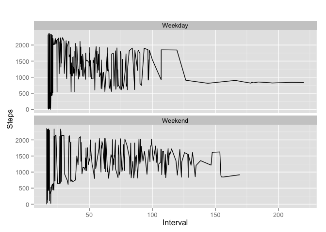

# Reproducible Research: Peer Assessment 1


## Loading and preprocessing the data

```r
library(dplyr)
```

```
## 
## Attaching package: 'dplyr'
## 
## The following objects are masked from 'package:stats':
## 
##     filter, lag
## 
## The following objects are masked from 'package:base':
## 
##     intersect, setdiff, setequal, union
```

```r
library(ggplot2)
#read the activity csv file into a variable, omit all NA values and 0s
activity_master <-read.csv("activity.csv", stringsAsFactors=FALSE)
activity <- na.omit(activity_master[activity_master$steps>0,])
```
## What is mean total number of steps taken per day?

```r
x<-aggregate(steps ~ date, data=activity, sum)
hist(x$steps, main="Histogram of total number of steps per day", xlab="Steps")
```

 

The mean is 1.0766 &times; 10<sup>4</sup> and median is 10765

## What is the average daily activity pattern?

```r
daily_pattern <- aggregate(steps~interval, activity, mean)
plot(daily_pattern$interval,daily_pattern$steps, type="l", main="Time Series of Interval VS Steps", xlab="Interval", ylab="Days")
```

 

```r
dev.off()
```

```
## null device 
##           1
```

The 5 minute interval that contains the highest number of steps is ``835``


## Inputing missing values
1. There are ``2304`` missing values in the dataset 

```r
val_by_day <-aggregate(steps ~ date, data=activity, mean)
```

2. The calculated mean, ``129.7411`` based on the aggregation by days with steps can be used as the actual value to populate the NA values. 

3. The following code takes care of the populating of NA values and the combination of the after populated NA values and the rows with existing values.


```r
value_for_na <- mean(val_by_day$steps)
set_with_na <- activity_master[is.na(activity_master$steps),]
set_with_na<-mutate(set_with_na, steps=value_for_na)
no_na_set <- activity_master[!is.na(activity_master$steps),]
combined_set<-rbind(no_na_set, set_with_na)
```

```r
combined_x<-aggregate(steps ~ date, data=combined_set, sum)
hist(combined_x$steps, main="Histogram of total number of steps per day-after na values", xlab="Steps")
```

 

There's an obvious difference between the 2 histograms, with the added data, the number of steps is increased. To note, the 0 values which were previously omitted, were included because the text specifically ask for replacement for NA value only.

## Are there differences in activity patterns between weekdays and weekends?

```r
week_days<-c("Monday","Tuesday","Wednesday","Thursday","Friday")
combined_set<-mutate(combined_set, Day=ifelse(is.element(weekdays(as.Date(combined_set$date)),week_days),"Weekday","Weekend"))
avg_steps <- aggregate(steps~interval + Day, combined_set, mean)
gplot<- ggplot(avg_steps, aes(steps, interval))
# adding a line layer onto gplot and creating facets for the 2 types of variables
gplot <- gplot + geom_line() + facet_wrap(~Day, nrow = 2, ncol = 1)
gplot <- gplot + labs(x = "Interval") + labs (y="Steps") + labs(title="")
gplot
```

 
